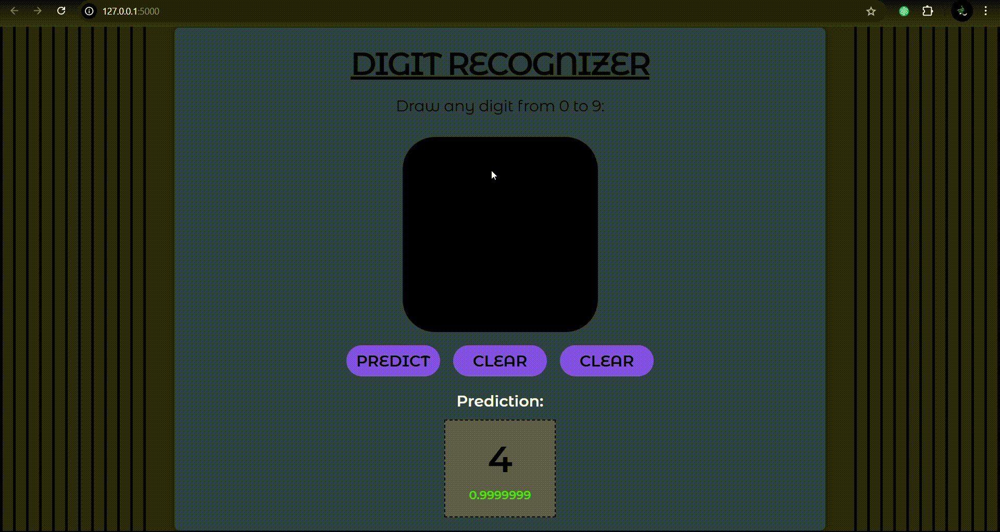
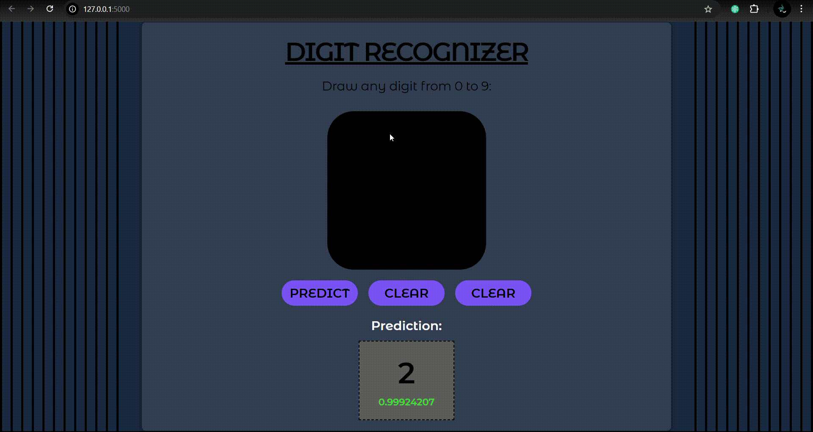

# 🔢 Digit Recognizer Web App

A simple web application that predicts hand-drawn digits (0–9) using a trained neural network model built on the MNIST dataset. Built with **TensorFlow**, **Keras**, **Flask**, and **JavaScript**.

---

## 📸 Demo




---

## 🚀 Features

- Draw any digit (0–9) on the canvas.
- Real-time prediction using a trained deep learning model.
- Shows predicted digit with confidence.
- Clean UI using HTML + JS with Flask backend.

---

## 🧠 Model Details

- **Dataset**: MNIST handwritten digit dataset
- **Architecture**:
  - Flatten input layer
  - Dense (128 units, ReLU)
  - Dense (128 units, ReLU)
  - Output layer (10 units, **Softmax**)
- **Accuracy Achieved**: ~97.5% on test data
- **Saved as**: `model-test.keras` (or `.h5` if using legacy format)

---

## 📁 Project Structure

```
digit_recognition/
│
├── static/                 # JS and CSS files
│   └── main.js
│   └── style.css
├── templates/
│   └── index.html          # Frontend interface
├── app.py                  # Flask backend
├── train.py                # Model training script
├── test.py                 # Optional test script
├── model-test.keras        # Trained model
|── requirements.txt        # Python dependencies
|── .gitignore
├── model-test.keras        # not need if used keras
├── digit0.gif
├── digit4.gif

```

---

## ⚙️ Installation

1. **Clone the repository:**
```bash
git clone 
cd digit_recognition
```

2. **Set up a virtual environment (optional but recommended):**
```bash
python -m venv venv
venv\Scripts\activate
```

3. **Install the dependencies:**
```bash
pip install -r requirements.txt
```

4. **Train the model (if not already trained):**
```bash
python train.py
```

5. **Run the web app:**
```bash
python app.py
```

Then go to http://127.0.0.1:5000 in your browser.

---

## 🖼️ How it Works

1. Draw a digit on the canvas.
2. The canvas image is converted to grayscale, resized to 28x28 pixels, and normalized.
3. The image is sent via a JSON POST request to the Flask backend.
4. The TensorFlow model predicts the digit and returns:
   - `prediction`: the predicted digit
   - `confidence`: model's probability for the prediction

---

## 🛠️ Technologies Used

- **Frontend**: HTML5, CSS3, JavaScript (Canvas API)
- **Backend**: Python, Flask
- **Machine Learning**: TensorFlow, Keras
- **Image Processing**: Pillow, NumPy

---

## 📌 Requirements

- Python ≥ 3.8
- TensorFlow ≥ 2.x
- Flask
- Pillow
- NumPy

Install with:
```bash
pip install tensorflow flask pillow numpy
```


## ✍️ Author

**Saumya Gupta**  
Connect on [LinkedIn]().
